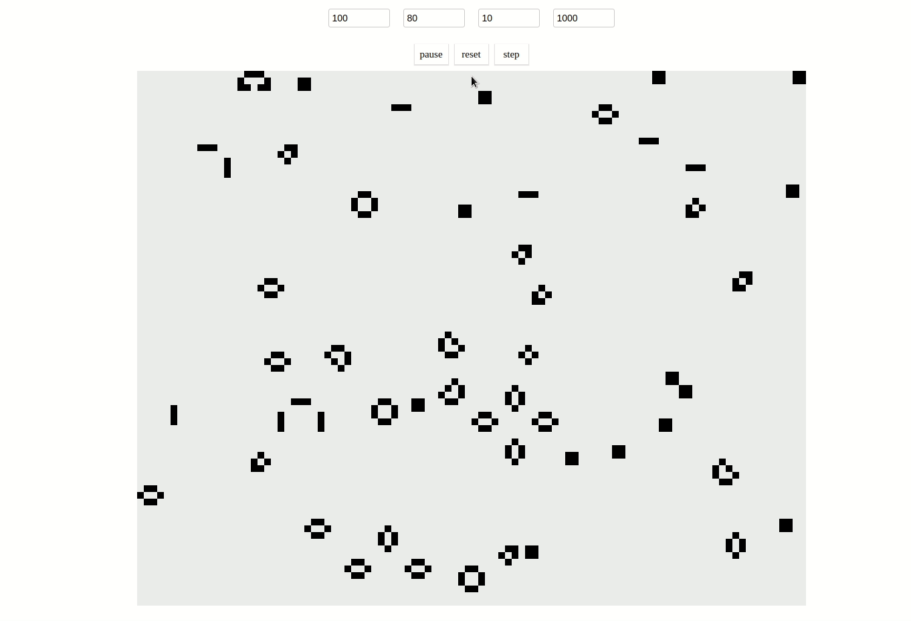
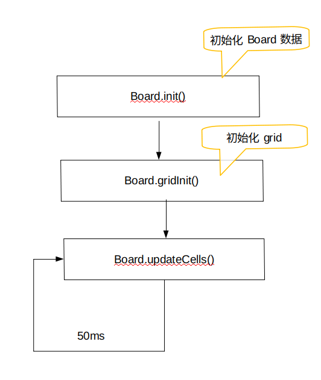

# 生命游戏

## 游戏介绍

>生命游戏中，对于任意细胞，规则如下：
>
>+ 每个细胞有两种状态 - 存活或死亡，每个细胞与以自身为中心的周围八格细胞产生互动
>   + 当前细胞为存活状态时，当周围的存活细胞低于2个时（不包含2个），该细胞变成死亡状态。（模拟生命数量稀少)
>   + 当前细胞为存活状态时，当周围有2个或3个存活细胞时，该细胞保持原样。
>   + 当前细胞为存活状态时，当周围有超过3个存活细胞时，该细胞变成死亡状态。（模拟生命数量过多）
>   + 当前细胞为死亡状态时，当周围有3个存活细胞时，该细胞变成存活状态。（模拟繁殖）

效果图如下： 

## 结构目录

```shell
.
├── babel.config.js     =>babel配置文件
├── css
│   └── index.styl         =>样式文件
├── dist
│   ├── index.html
│   ├── main.bundle.js
│   └── vendors~main.bundle.js
├── index.html
├── index.js                       =>入口文件
├── js
│   ├── board.js               =>画板类
│   ├── cell.js                    =>细胞类
│   └── control.js             =>控件类
├── package.json
├── readme.md
├── test                                =>测试文件
│   └── board.test.js
├── webpack.common.js
├── webpack.dev.js
├── webpack.prod.js
└── yarn.lock
```

## 实现思路

一共有三个模块，`cell`，`board`，`control`。

+ `cell` 根据周围细胞的状态，更新自身状态；根据自身的状态位置绘制canvas。
+ `board` 用一个一维数组模拟细胞状态，一个二维数组存储Cell实例，控制细胞更形状态
+ `control` 获取界面上的各种控件，监听点击事件触发 `board` 实例方法。

### 点击start按钮发生了什么

1. 获取input的框的四种数据 `{x,y,celldWith,liveCellNums}` 横轴细胞数，纵轴细胞数，细胞宽度，初始存活细胞数

    ```js
    this.bord.init( this.getInputDatas())
    this.bord.startAnimation()
    ```

2. 将得到的对象作为参数传给 `board.init` 方法，会覆盖 `board.BoardData` 的默认值，然后调用`board.gridInit()` 初次绘制canvas，并生成 `board.grid` 二维数组来存储Cell实例。

    ```js
    Bord.init(data) {
            this.BoardData = data
            this.gridInit()
        }
    ```

    + `board.gridInit` 会调用 `board.getRandCellStatus()` 方法，来生成01一维数组作为参数的默认值，来模拟细胞状态，接着就是双重for循环创建 `cell` 实例，并调用 `cell.drawSelf` 方法绘制canvas。
    + `board.getRandCellStatus()` 会根据细胞总数，以及预设的存活细胞数，来反回一个01一维数组，用来模拟细胞状态。
    + 创建 `cell` 实例时会调用 `board.getNeighborIndex` 来获取当其相邻细胞的索引并传给实例

3. `board.init()` 执行完后会继续执行 `bord.startAnimation()` 方法，每间隔50ms执行一次 `bord.updateCells()` 方法，以上就是主要过程了。

    + `bord.updateCell` 方法会遍历存储 `board.grid` 里面的 `cell` 实例，并执行 `cell.updataStatus` 方法更新自身状态，该方法还会返回更新后的状态，我们可以把他存储在局部变量 `shadowStatusLists` 里，待遍历完后将其赋值给 `board.statusList` 。这样就获取到更新后的细胞状态数组。



## 关于测试

采用 [`jest`](https://jestjs.io/zh-Hans/) 测试框架，测试了 `board` 的 `getNeighborIndex` 和 `updateCells` 两个函数

## 运行

1. `git clone git@github.com:so-hard/game-of-life.git`

2. `cd game-of-life`

3. `yarn` || `npm install`

4. `yarn serve` || `npm run serve`
